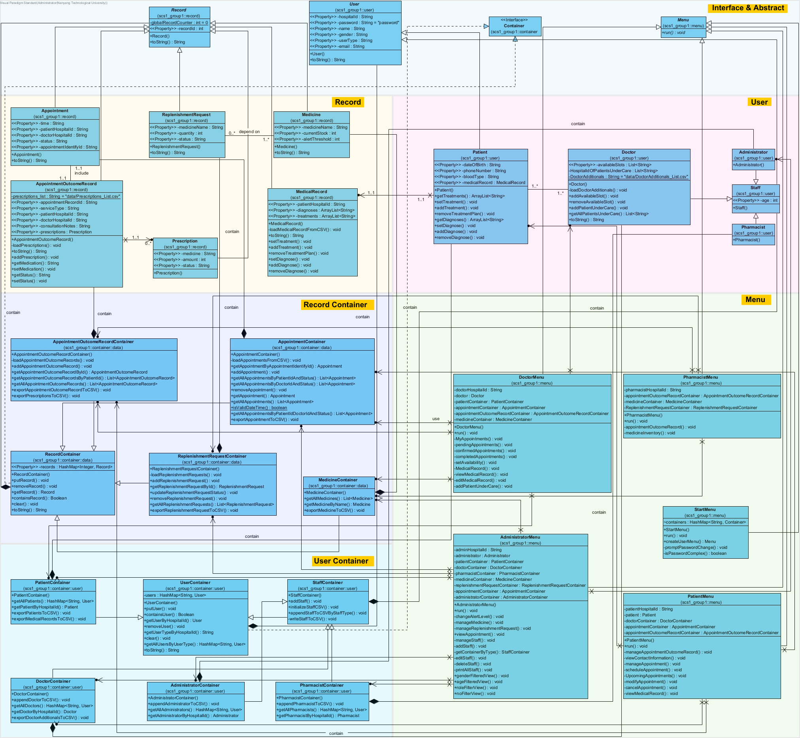

<div align="center">

# Hospital Management System (HMS) <br/><br/> SC2002 SCS1 Team 1

</div>

<br/>

Report can be found in the `./report` folder.

## Table of Contents

- [Overview](#overview)
- [Team Members](#team-members)
- [Features](#features)
- [Design Principles](#design-principles)
- [Project Structure](#project-structure)
- [Technology Stack](#technology-stack)
- [Prerequisites](#prerequisites)
- [Installation and Usage](#installation-and-usage)
- [Documentation](#documentation)
- [UML Class Diagrams](#uml-class-diagrams)
- [Code of Conduct](#code-of-conduct)
- [License](#license)

---

## Overview

This is a Java-based Hospital Management System (HMS) that manages patient records, doctor availability, appointment scheduling, prescriptions, and more. This project is structured using Maven as the build tool and includes Log4j2 for logging capabilities.

## Team Members

<table>
  <tr>
    <td align="center"><a href="https://github.com/SunnyRaymond" target="_blank"></a><br /><sub><b>Guo Yichen</b></sub><br /></td>
    <td align="center"><a href="https://github.com/lyk6666" target="_blank"></a><br /><sub><b>Li Yikai</b></sub><br /></td>
    <td align="center"><a href="https://github.com/zhenxi0901" target="_blank"></a><br /><sub><b>Li Zhenxi</b></sub><br /></td>
    <td align="center"><a href="https://github.com/xubin0" target="_blank"></a><br /><sub><b>Cai Xubin</b></sub><br /></td>
    <td align="center"><a href="https://github.com/Loeeeen" target="_blank"></a><br /><sub><b>Liang Jianpeng</b></sub><br /></td>
  </tr>
</table>

## Features

- **User Roles**: Supports multiple roles including doctors, patients, and administrators.
- **Patient Management**: Patients can view and edit their personal information.
- **Appointment Management**: Schedule, confirm, and cancel appointments with doctors.
- **Medical Records**: Doctors can add consultation notes and prescriptions for patients.
- **Doctor Availability**: Doctors can set their availability for appointments.
- **Logging**: Integrated Log4j2 for error and event logging.

## Design Principles

1. **Single Responsibility Principle (SRP)**
   - Focuses on having each class responsible for a single purpose or actor.
2. **Open Closed Principle (OCP)**
   - Software entities should be open for extension but closed for modification.
3. **Liskov Substitution Principle (LSP)**
   - Subtypes must be substitutable for their base types.
4. **Interface Segregation Principle (ISP)**
   - Large interfaces should be split into smaller, more specific ones.
5. **Dependency Injection Principle (DIP)**
   - High-level modules should not depend on low-level modules but on abstractions.

## Project Structure

The project follows a modular structure to separate concerns:

- `scs1_group1.Main`: Entry point of the application.
- `scs1_group1.menu`: Contains classes to manage user menus for each role (e.g., DoctorMenu, PatientMenu).
- `scs1_group1.user`: Classes representing different user roles like `Doctor`, `Patient`, and `Administrator`.
- `scs1_group1.record`: Handles medical records, appointment records, and prescriptions.
- `scs1_group1.container`: Manages data containers for users and records (e.g., `PatientContainer`, `AppointmentContainer`).

## Technology Stack

- **Language**: Java
- **Data Storage**: CSV files for data storage

## Prerequisites

- Java 17
- Maven

## Installation and Usage

1. Clone the repository:

   ```bash
   git clone https://github.com/SunnyRaymond/SC2002-HMS.git
   cd HMS
   ```

2. Compile the project using Maven:
   ```bash
   mvn compile
   ```
3. **Run the Application**:
   Start the application by running the `Main` class through Maven:
   ```bash
   mvn exec:java
   ```

## Documentation

For detailed documentation, refer to the `./docs` directory.

[View the Java Documentation live](https://sc2002-hms-scs1-group1-javadoc.netlify.app/)

## UML Class Diagrams

Class diagrams can be found in the `./diagrams` folder.



## Code of Conduct

We are committed to ensuring a welcoming and inclusive environment for everyone. We expect all participants in this project to adhere to our Code of Conduct.

## License

Licensed under the [MIT License](https://github.com/SunnyRaymond/SC2002-HMS).
